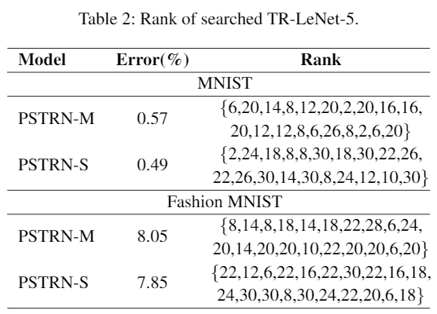
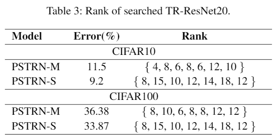
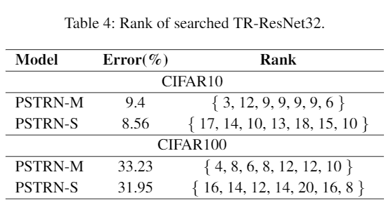
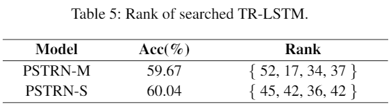

# Heuristic Rank Selection with Progressively Searching Tensor Ring Network

Recently, Tensor Ring Networks (TRNs) have been applied in deep networks, achieving remarkable successes in compression ratio and accuracy. Although highly related to the performance of TRNs, rank is seldom studied in previous works and usually set to equal in experiments. Meanwhile, there is not any heuristic method to choose the rank, and an enumerating way to find appropriate rank is extremely time-consuming. Interestingly, we discover that part of the rank elements is sensitive and usually aggregate in a certain region, namely an interest region. Therefore, based on the above phenomenon, we propose a novel progressive genetic algorithm named Progressively Searching Tensor Ring Network Search (PSTRN), which has the ability to find optimal rank precisely and efficiently. Through the evolutionary phase and progressive phase, PSTRN can converge to the interest region quickly and harvest good performance. Experimental results show that PSTRN can significantly reduce the complexity of seeking rank, compared with the enumerating method. Furthermore, our method is validated on public benchmarks like MNIST, CIFAR10/100 and HMDB51, achieving the state-of-the-art performance.

## Requirements
- python                 3.7
- torch                  1.6.0
- torcherry              0.0.9
- nvidia-dali-cuda100    0.24.0
- pymoo                  0.3.0

## Performance Result
1. Results of TR-LeNet-5

    
2. Results of TR-ResNet20

    
3. Results of TR-ResNet32

    
4. Results of TR-LSTM   

    

## Prepare
For all `.py` files in `.\train` and `.\validation`, the `sys.path.insert(0, './PSTRN_id640_code_and_data')` needs to be changed to your own path.

## Train 
    cd train
    python train_mnist.py/train_fashion_mnist.py/train_cifar10.py/train_cifar100.py/train_hmdb51.py --model [TR-based model] --rank [rank elements]

## Evaluate
    cd validation
    python valid_mnist.py/valid_fashion_mnist.py/valid_cifar10.py/valid_cifar100.py/valid_hmdb51.py --model [TR-based model] --rank [rank elements] --pre-train-model-path [pretrained model path]

### Remark
Due to the maximum file size limit (350Mb) for the CodeAndDataAppendix in AAAI2021, we cannot upload the HMDB51 dataset. To verify the performanca of searched TR-LSTM, you can view the training logs on tensorboard. And you will find that it is not a complete training, which is beacause the model is trained by loading pretrained weights in search process.

    cd save/HMDB51/PSTRN-M
    tensorboard --logdir=logs
